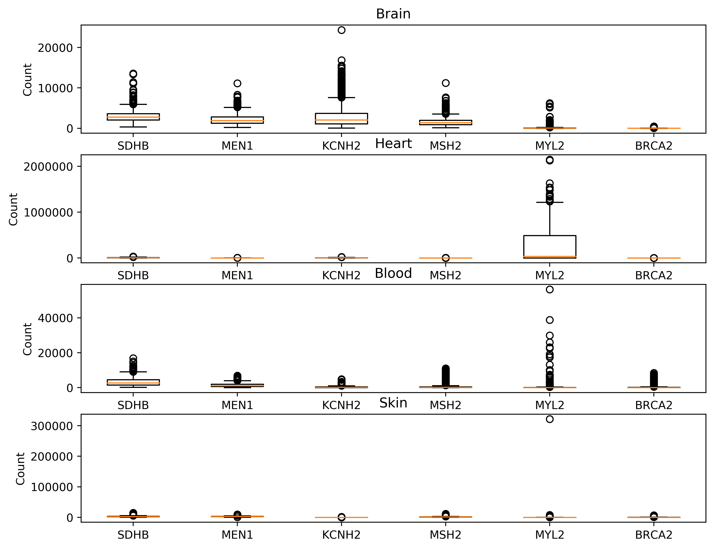

# workflow-chzh1418

## Raw Data
### Didn't upload the count file because file too big, thus all the tests use locally generated files.
* https://github.com/swe4s/lectures/blob/master/data_integration/gtex/GTEx_Analysis_2017-06-05_v8_RNASeQCv1.1.9_gene_reads.acmg_59.gct.gz?raw=true
* https://storage.googleapis.com/gtex_analysis_v8/annotations/GTEx_Analysis_v8_Annotations_SampleAttributesDS.txt

## Continuous integration
[](https://travis-ci.com/cu-swe4s-fall-2019/workflow-chzh1418)

## Environment setup
```
before_install:
    - wget https://repo.anaconda.com/miniconda/Miniconda3-latest-Linux-x86_64.sh
    - bash Miniconda3-latest-Linux-x86_64.sh -b
    - . /home/travis/miniconda3/etc/profile.d/conda.sh
    - conda update --yes conda
    - conda config --add channels r
    - conda create --yes -n test
    - conda activate test
    - conda install -y pycodestyle
    - conda install --yes python=3.6
    - conda install --yes matplotlib
    - conda install -y -c bioconda snakemake
```

## Usage

### get_gene_counts.py 
```
python get_gene_counts.py --count_file GTEx_Analysis_2017-06-05_v8_RNASeQCv1.1.9_gene_reads.gct.gz --gene_name FOXC1 --out_file test1.txt
```
### get_tissue_samples.py
```
python get_tissue_samples.py --attribute_file GTEx_Analysis_v8_Annotations_SampleAttributesDS.txt --tissue_group 'Blood' --out_file test2.txt
```

### box.py
```
python box.py --tissue Blood Brain --genes FOXC1 NFATC1 --out_file 'test3.png
```

### snakemake
main program, the main program checks and takes output from get_gene_counts.py and get_tissue_samples.py and then use box.py to plot the results
```
snakemake --use-conda
```

